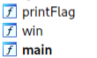
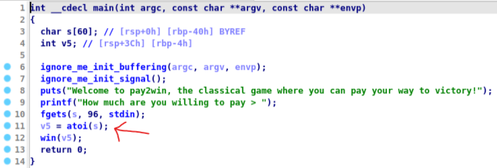
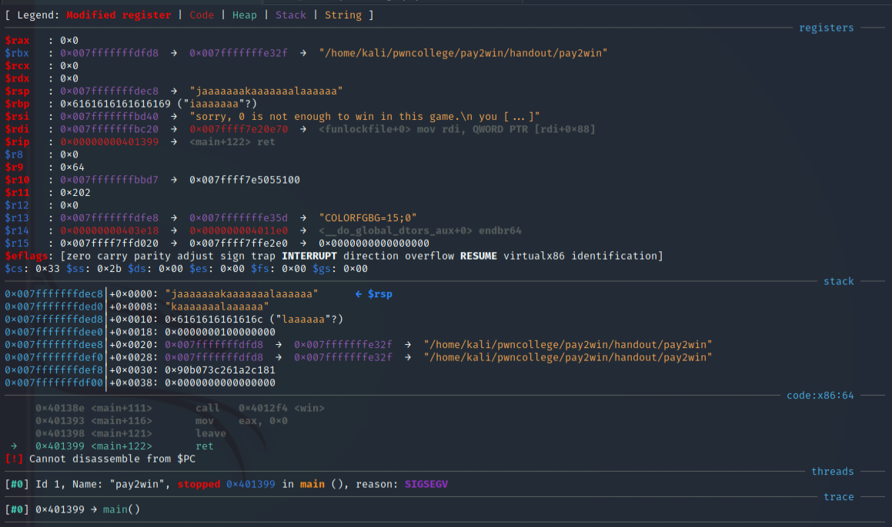
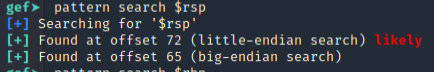
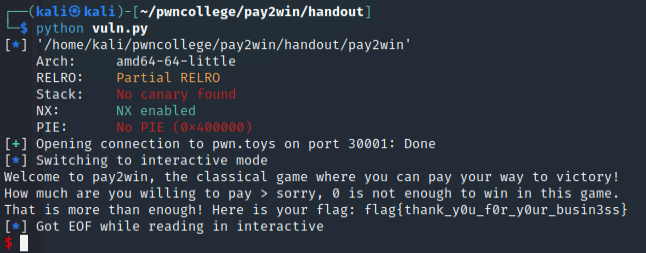

# Challenge:

**AUTHOR**
`nordbo`
**DESCRIPTION**
`How much are you willing to pay2win?`
`nc pwn.toys 30001`

# Solution

we're given two files: the compiled code (`pay2win`) and the source code (`pay2win.c`)
By opening `pay2win` in IDA, we can see that there are 3 functions, printFlag(), win() and main().



By looking at the source code, or preferably the decompiled code, we see that the code is vulnerable to a buffer overflow attack on line 11.


Since a function (`win()`) is called right after `atoi()`, that means the return adress for `win()` will be right after v5 in the stack. Consequently we can overflow v5 to overwrite the return adress for `win()` to `printFlag()`.

### Finding Offset

We need to first check for the offset of v5. I did this using gbd-gef's `pattern create` and `pattern search` functions.


After inputting the pattern:

looking at reason, we successfully caused a `segmentation fault` aka `SIGSEGV`.
Now we use `pattern search $rsp` and find the offset at `72`



### Execution

To execute an attack, or to "pwn the program". For this challenge, im going to use pwntools. 
Initialize a python program using `pwn template --host pwn.toys --port 30001 --quiet ./pay2win > vuln.py`. The exploit we add is:
```py
input_value = b'A' * 72 + p64(0x4012da)
io.sendline(input_value)
```

`b'A' * 72` is the offset, we spam A's and `p64()` is the adress of printFlag() which we found in IDA.


### Getting the flag!


